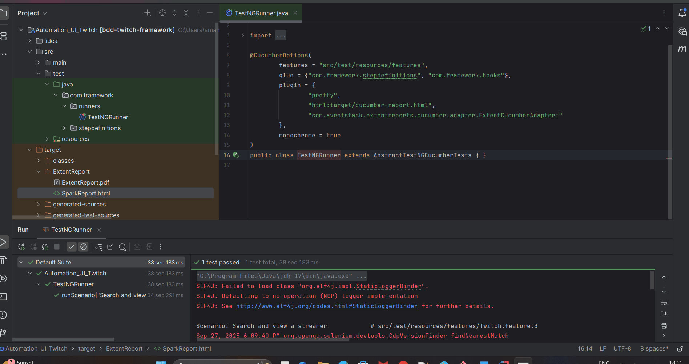

# Twitch UI Automation (BDD + Java + Selenium)

This project demonstrates automated **UI testing** of the [Twitch mobile site](https://m.twitch.tv) using **Java**, **Selenium WebDriver**, **Cucumber (BDD)**, **TestNG**, and **Extent Reports**.  
It follows a **Page Object Model (POM)** design for maintainability and readability.

---

## 📋 Test Scenario (as per assignment)

1. Open **Twitch** in Google Chrome **Mobile Emulator**.  
2. Search for **"StarCraft II"**.  
3. **Scroll down 2 times**.  
4. Select one streamer from the search results.  
5. Handle any **modals/popups** before video loads.  
6. Wait until the video stream loads successfully.  
7. Take a **screenshot** once loaded.  

---

## 🎥 Demo Run




## 🛠️ Tech Stack

- **Language**: Java 11+  
- **Build Tool**: Maven  
- **Test Runner**: TestNG  
- **BDD Framework**: Cucumber (Gherkin)  
- **Automation**: Selenium WebDriver  
- **Reporting**: Extent Reports (HTML + PDF), Cucumber HTML  

---

## 📂 Project Structure

```
Automation_UI_Twitch
│── src
│   ├── main/java/com/framework
│   │   ├── drivers        # WebDriver setup with Mobile Emulation
│   │   ├── pages          # Page Object Model classes
│   │   └── utils          # Utilities (ModalHandler, ScreenshotUtil, etc.)
│   └── test/java/com/framework
│       ├── stepdefinitions  # Step definitions for feature files
│       ├── runners          # TestNG & Cucumber runners
│       └── hooks            # Hooks for setup/teardown
│── src/test/resources/features
│   └── Twitch.feature
│── pom.xml
│── README.md
│── docs/demo.gif           # Demo run GIF
```

---

## 📱 Mobile Emulation

The framework is configured to run in **Google Chrome Mobile Emulator**.  

```java
Map<String, String> mobileEmulation = new HashMap<>();
mobileEmulation.put("deviceName", "Pixel 2");

ChromeOptions options = new ChromeOptions();
options.setExperimentalOption("mobileEmulation", mobileEmulation);
```

This ensures all tests run in a **mobile viewport**.

---

## ▶️ How to Run Tests

Clone the repo and execute:

```bash
mvn clean test
```

---

## 📊 Reports

After execution, reports are generated under `target/`:

- **Extent Spark HTML Report** → `target/ExtentReport/SparkReport.html`  
- **Extent PDF Report** → `target/ExtentReport/ExtentReport.pdf`  
- **Cucumber HTML Report** → `target/cucumber-report.html`  
- **Screenshots** → `target/screenshots/`  

---

## 🎥 Demo Run


---

## ✅ Key Features

- Runs in **mobile emulator** mode.  
- Implements **Page Object Model (POM)**.  
- Handles **modals/popups** gracefully.  
- Generates **rich Extent & Cucumber reports** (HTML + PDF).  
- Takes **screenshots** for key validations.  

---

## 📌 Notes

- Ensure **Google Chrome** and **ChromeDriver** are installed.  
- Update `DriverFactory` if you want to emulate a different device.  
- This project is intended as a **submission-ready example** for the given assignment.

---
